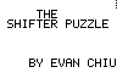
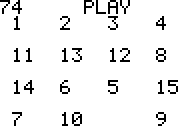
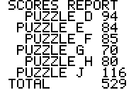

# The Shifter Puzzle

The Shifter Puzzle is the oldest code that I still possess.  I had just started learning write code on my TI 83+ Graphing Calculator during my sophomore year of high school.  The Shifter Puzzle was an interactive game allowing the single player to play the classic [Sliding puzzle](https://en.wikipedia.org/wiki/Sliding_puzzle), by sorting the numbers one through fifteen by sliding them around a grid.  The game kept track of the number of moves made, and kept track of the player's best scores.

## History
Today in 2018, I've finally excavated and can now publish the code. My wife had heard me lamenting that I still had some code on my graphing calculator and would love to capture and preserve it, so she bought the [Ti Graphlink USB](https://www.amazon.com/dp/B00006BXBS) for my birthday!!  I couldn't get it to work on my Mac, but the Windows version of [TI Connect](https://education.ti.com/en/software/details/en/14D11109C9F44D55B9BBF65E5A62E7F1/swticonnectsoftwareforwindows#!) worked, and I was able to copy the programs and data matricies from the calculator.

## Repository contents
* [/8xp](8xp) - The programs are available in TI's binary program format. `APUZZLE` is the starting point.
* [/data](data) - The preshuffled puzzles are avaiable as csv (Comma-separated value) files
* [/txt](txt) - Thanks to [Cemetech](https://www.cemetech.net/sc/), the text of the code is also available.